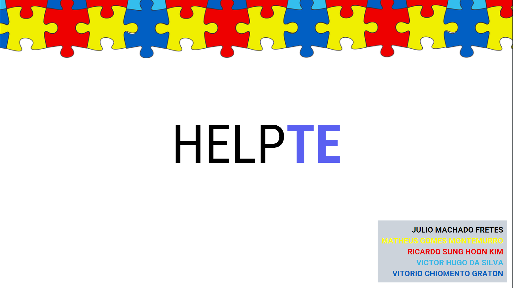
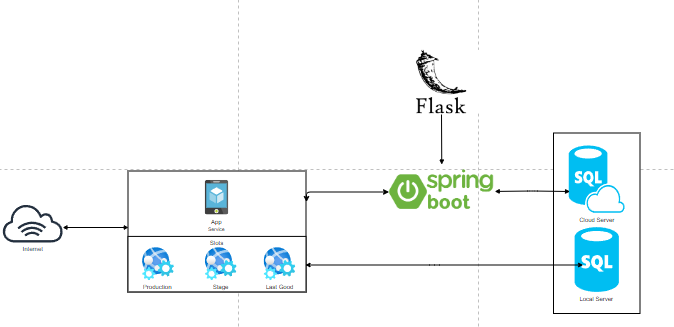

# HelpTE

`TABELA USUÁRIO`
| Método HTTP | Endpoint | Código de status | Descrição
|-------------|----------|------------------|----------
| GET | /usuarios | 200 | Retorna a lista de todos os usuários
| GET | /usuarios/:id | 200 | Retorna os dados do usuário com o id especificado
| POST | /usuarios | 201 | Cria um novo usuário
| PUT | /usuarios/:id | 200 OU 204 | Atualiza os dados do usuário com o id especificado
| DELETE | /usuarios/:id | 200 OU 204 | Deleta o usuário com o id especificado

`TABELA HISTÓRICO`
| Método HTTP | Endpoint | Código de status | Descrição
|-------------|----------|------------------|----------
| GET | /historicos | 200 | Retorna a lista de todos os históricos
| GET | /historicos/:id | 200 | Retorna os dados do histórico com o id especificado
| POST | /historicos | 201 | Cria um novo histórico
| PUT | /historicos/:id | 200 OU 204 | Atualiza os dados do histórico com o id especificado
| DELETE | /historicos/:id | 200 OU 204 | Deleta o histórico com o id especificado

`TABELA CONFIGURAÇÃO`
| Método HTTP | Endpoint | Código de status | Descrição
|-------------|----------|------------------|----------
| GET | /configuracoes | 200 | Retorna a lista de todas as configurações
| GET | /configuracoes/:id | 200 | Retorna os dados da configuração com o id especificado
| POST | /configuracoes | 201 | Cria uma nova configuração
| PUT | /configuracoes/:id | 200 OU 204 | Atualiza os dados da configuração com o id especificado
| DELETE | /configuracoes/:id | 200 OU 204 | Deleta a configuração com o id especificado

| Códigos de status
|------------------
| 200 OK: Solicitação bem-sucedida
| 201 Created: Recurso criado com sucesso
| 204 No Content: Recurso excluído com sucesso
| 400 Bad Request: Solicitação inválida
| 401 Unauthorized: Não autorizado a acessar o recurso
| 404 Not Found: Recurso não encontrado
| 500 Internal Server Error: Erro interno no servidor

| Verbos HTTP
|------------
| GET: Obter dados
| POST: Criar um novo recurso
| PUT: Atualizar um recurso existente
| DELETE: Excluir um recurso existente

## Solução

Os autistas podem ter dificuldade em identificar, compreender e expressar suas emoções e sentimentos, o que pode resultar em problemas de comunicação e relacionamento. Para ajudar a superar esses desafios, criamos o HelpTE que tem como objetivo criar uma solução que utilize a fala, texto e a API do Microsoft Azure para traduzir as emoções de pessoas autistas em palavras, permitindo uma comunicação mais eficiente,sendo esses os três principais recursos que podem ser utilizados.
O principal objetivo do projeto é desenvolver uma solução que permita às pessoas autistas reconhecer as emoções expressadas através de uma interface de voz e texto. A solução poderia utilizar os três recursos API de reconhecimento de fala e processamento de linguagem natural do Microsoft Azure para identificar as entradas dos usuários (textoáudio) e através do processamento do chat gpt interpretar as emoções contidas na entrada do usuário.API de análise de sentimento Outro recurso que poderíamos utilizar é a API de análise de sentimento do Azure ela determina o tom emocional das palavras expressas pelos usuários, ajudando a entender melhor suas emoções e sentimentos, no entanto, por se tratar de uma plataforma paga optamos em usar ferramentas gratuitas e o chatgpt que foi solicitado pela plusoft.
Existem outras  funcionalidades que o Microsoft Azure oferece de computação em nuvem, essas que citamos fala, análise de texto e análise de sentimento. São as que seriam úteis para o nosso projeto, com o recurso de fala, é possível transformar áudio em texto. Já a análise de texto permite extrair percepções valiosas dos sentimentos, enquanto a API de análise de sentimento permitiria uma eficácia na tradução dos sentimentos . Com essas ferramentas,acreditamos estar utilizando da melhor forma o Azure em nosso projeto dando ênfase nas principais funcionalidades do nosso software,  por se tratar de uma plataforma de nuvem altamente confiável, que oferece uma série de recursos de segurança e privacidade de dados. sentimos confiantes em deixar as funções no servidor.

## Descrição das principais funcionalidades do sistema

Tradução - Pegar o input do usuário e formar um output traduzindo o que a frase emotiva significa. 

Cadastro - O usuário insere as informações solicitadas pelo sistema e cadastra no banco de dados. Informações solicitada:
Nome
Idade
Usuário
Senha 

Login - Para o usuário ser autenticado ele precisará preencher “Usuário” & “Senha” preenchidos no cadastro anteriormente.

Histórico - O histórico irá conter as informações de data e hora, as frases e emoções na frase. Todo o histórico de conversa do usuário com a IA vai ficar armazenada nesta funcionalidade.

## Vídeo

## Arquitetura da Solução

